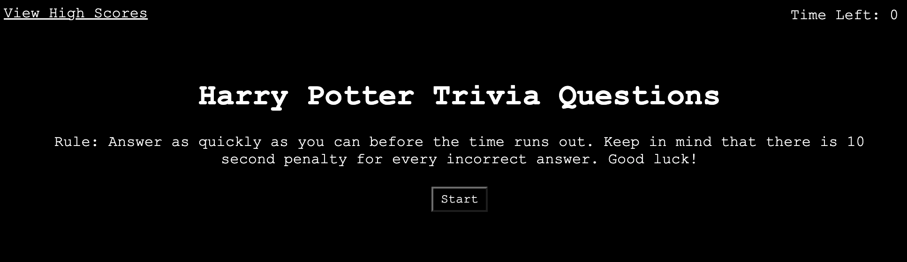
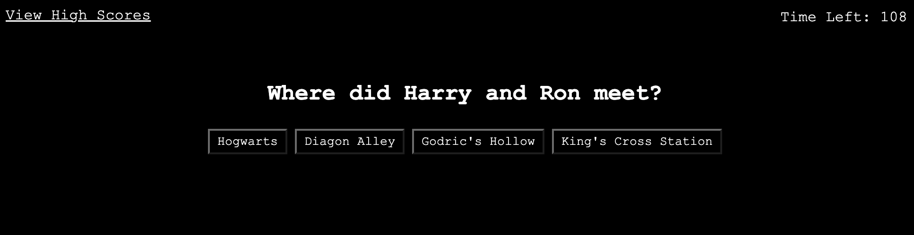
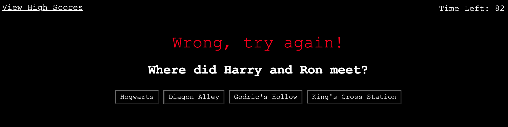
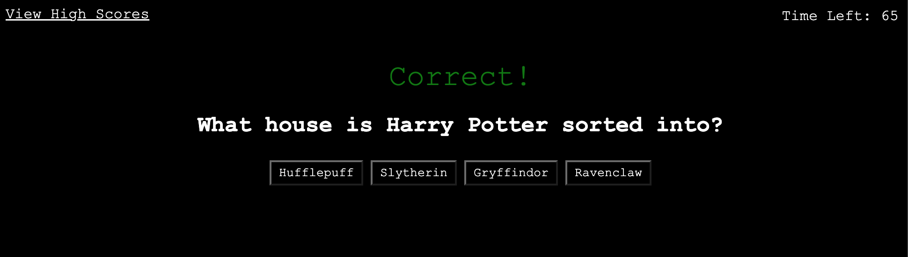

# Web-API-Code-Quiz


## Your Task
Build a timed coding quiz with multiple-choice questions. This app will run in the browser and will feature dynamically updated HTML and CSS powered by JavaScript code that you write. It will have a clean, polished, and responsive user interface. 


## User Story

```
AS A coding boot camp student
I WANT to take a timed quiz on JavaScript fundamentals that stores high scores
SO THAT I can gauge my progress compared to my peers
```

## Acceptance Criteria

```
GIVEN I am taking a code quiz
WHEN I click the start button
THEN a timer starts and I am presented with a question  ✅
WHEN I answer a question
THEN I am presented with another question  ✅
WHEN I answer a question incorrectly
THEN time is subtracted from the clock  ✅
WHEN all questions are answered or the timer reaches 0
THEN the game is over  ✅
WHEN the game is over
THEN I can save my initials and my score  ✅
```

## Application Screenshots

The following screen shots demonstrate the application functionality:


Home screen to start the quiz.

---


When start button is clicked, first question pops up.

---



If player chooses a wrong answer, timer decreases. Player needs to guess the right answer in order to move to the next question.

---



If player chooses the correct answer, next question pops up.

---


When the game is over, final score displays and the player is asked to enter initials.

---


When the initial is submitted, it is stored and displayed in the score board.

---


The clear button clears the stored scores.

---

